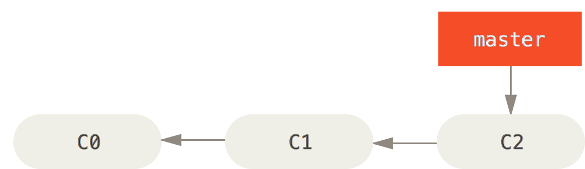

# Git

If you have no idea what Git or version control are, continue reading.

If you are already comfortable with Git, but are curious how it actually works, skip to "Design and Inner Workings".

If you are already comfortable with Git, but just want to learn some new sweet commands, skip to "Useful Git commands".

## What is Git?

In the simplest terms, Git is a version control system (VCS).
Historically, the purpose of a VCS is exclusively to track changes to files over time.

Though this does not sound like a particularly amazing feat, it is a hard process to get right if you are trying to do it manually.

Manually saving entire copies of a project is incredibly costly on disk space, which puts a premium on backups.
Not to mention renaming copies of folders
from
`cool-project-v2-2016-05-02-10:15 (1)`
to
`cool-project-v2-2016-05-02-10:32`
can get pretty tedious.

Alternatively, to save on disk space, you can copy only the files that changed into these successive folder copies, but then actually viewing the project in full at any given point becomes incredibly difficult.

VCS seeks to alleviate this by offering simple abstractions on top of this project diff business that work at scale.

Someone who is not familiar with VCS might assume this is only useful for a project wide 'undo history'.
However, in practice, using VCS, and Git successfully means treating it much more like a supportive function than just an undo button.

## What are the benefits?

Though not exhaustive, the following list of tangible benefits should (hopefully) spark your interest:

- Extensive project versioning that:
  - Allows viewing the state of a project at any point in time easily
  - Doesn't use unnecessary disk space for full project clones.
- Intelligent tools and supporting capabilities that are possible because of the management of project history.
- Implicit documentation of each change that happens to a project, which shows the path of implementation the developer took to complete a feature/fix an issue.
- Low risk experimentation with single/multiple files, solo or collaboratively, as changes can be selectively undone or left unapplied.
- Collaboration across multiple people can happen asynchronously without:
  - Race conditions when writing to the same file on a central server.
  - Drastic file differences when team members work in isolation.
  - Different development intents can be worked on in parallel.
- Basic backup happens as part of the workflow, and extending to bulletproof backups is simpler
- Software versioning, either as part of release cycles, or maintaining variants, is simplified.

## Evangelism?

While this guide focuses on Git, as it is the VCS I use most often because I am quite happy with it, Git is not a be all end all.
There are other systems that perform similarly to Git, and have different tradeoffs that might make more sense depending upon your use case.

The important thing is to use a true VCS of __some__ kind.
Even if you are developing/writing solo, the utility a VCS provides over manual backups (or worse, nothing at all!) cannot be overstated.

Beyond this point, things become increasingly Git focused.

_You have been warned..._

## Design and Inner Workings

### The Cathedral and the Bazaar

All VCS help track versions of files as people modify them.
In this sense, Git is no different.

Though each VCS might implement different nifty features and workflows, the basic idea is the same.

However, because people like to put things into categories, VCS systems are usually divided into two main genres:

- Distributed
- Centralized

#### Centralized

Centralized VCS function by maintaining a single master copy of a project somewhere (probably a server).

As a team member working on a project using Centralized VCS, you directly attempt to apply patches to a server.
Anytime you get a file, you are getting the most recent version that the server yields.

This means that a developer's machine has little to no record of the actual project history, and all project affecting actions require a networked connection to this centralized server.

Though an extensive pro and con list is outside of the scope of this document, I will remark that this architecture is probably the one that is the most intuitive to someone seeking to implement a VCS, at least at first.
As in, someone interacting with a VCS, not knowing much better, would probably assume this is how all interactions take place.

Examples of Centralized VCS include: SVN, CVS, and Perforce.

#### Decentralized

Decentralized VCS (DVCS) changes one important detail about this model.
There is no central server in DVCS.
There can be a server that holds onto the project and its history and all of its metadata, but the server does not have any special functionality or privileges over any other user.

Each and every user maintains the exact same information that this server holds, and as such, every local machine could function as a server and a client.
In a DVCS, you are simply modifying your local project, recording what has changed, and then sending a list of patches to another client.

If you were so inclined, two or more people could have a local copy of a project, make changes, and then directly send their changes to each and every other developer machine.
All of the mechanics of patch-exchanges would work identically.

In practice, this is not how people utilize DVCS, and still have a central host that is semantically treated as a "master".
However, should anything happen to this master, or should a network connection not be available, the changes a developer makes to their local project are entirely unhindered.

Once the server becomes available again, they can simply send along all of the patches they created in the meantime to the server.
Afterwards, each developer is free to grab these patches from the server, and add them to their local clone of the project.

However, this model has its issues as well, and is made possible by a lot of fairly sophisticated diffing. Usually this is entirely automatic, but sometimes, it can be painfully manual.

Again, measuring the pros and cons of each VCS type is not within the scope of this document, but I personally believe DVCS is an improvement over Centralized VCS.

If you have not guessed yet, Git falls into the category of DVCS.

Examples of Decentralized VCS include: Git, Mercurial, BitKeeper.

### How Git Exists in a Project

To start, the way git actually manages a project is through a hidden .git folder that exists within the root of the project.

This is the folder that marks the difference between a project managed by Git, and one that does not. The entire project history, and all supporting metadata that exists for that project is within this folder.

As a result, if you have a project managed by Git, and you no longer want to manage it via Git, and do not care about the history Git has managed, simply __deleting the .git folder is all that is necessary to stop using Git and remove all history for that project__.

That sounds scary, but chances are, you will not manually edit anything in the .git folder for the entire duration of your career, and _almost_ all Git commands append new information to the history, rather than change previous history.

As a result, it is __very hard__ to lose information about your project when you are working with Git.

### The Three Main Git States

During everyday use, a file and associated changes, as managed by Git, can exist in three main states (there are a few more, but they aren't necessary to get started).

The three main states are:

- The Working Directory
- The Staging Area
- The .git directory


The working directory, for all intent and purposes, is how your project exactly exists on your filesystem. You interact with these files how you normally would. You may edit, delete, move, and copy with any tools you see fit. If a file only exists in the working directory, and git has never tracked changes for the file, it is referred to as "Untracked".

Once you are happy with the state of a file, or many files, or even a few lines that were changed in a file, you run a git command (`add` in this case) to make the staging area aware of these changes. Imagine the staging area as a transport platform with a box on it, waiting to have references to file changes added in to it.

After we have made the staging area aware of all the file changes we plan to package together, we must now bundle up the box, and send it to the .git directory (which models the repository history).

To do this, we attach a message to this bundle, briefly describing the intent of these changes, and then we `commit` this bundle to the permanent project history.

The entire staging area is sent at once to the .git directory, but you may selectively choose what changes in the working directory are made known to the staging area at any given time. This is how you may finely manage what exactly one `commit` encompasses.

Once changes are commited, they are solidified as a new snapshot in Git's representation of the project history.

All the data Git manages is generated as part of this process. Every other supporting functionality Git offers is just tooling around this information.

### The push/pull Lifecycle

#### Remote

So you have your git repository coming along nicely, making steady progress on your project, but now someone else wants to collaborate with you. Sure, git will manage changes efficiently as snapshots, but if collaborating means copying the project around on flash drives, that all goes out the window anyway.

This is where the push/pull lifecycle comes in, and honestly it is a very simple concept. Though each developer/writer has a copy of the project locally, there is usually a centrally stored version of the project on a server somewhere as well.

So imagine a developer is working on a project alone, and has a lot of progress, but now wants to collaborate. What they will do is set the Git server's endpoint as their remote point (this remote point is set automatically if the project was cloned).

This remote (if there is only one) is usually referred to as origin.

#### Push

Then, they will run `git push origin master`.

The `master` business will be explained later, but this command tells `git` to `push` all of the information about the project in my local .git repository to the `origin` (usually over the network). This is an efficient diff, as it will only send what the server doesn't know already each time.

Keep in mind this is only pushing the .git repositories knowledge, so anything currently in staging or the working directory only won't be a part of the push.

#### Pull

If some other developer/writer also had a local copy of that project on their machine, they could then run `git pull origin master`, which is (sort of) the opposite to `git push origin master`.

Ignoring the `master` stuff again, this command tells `git` to `pull` the .git repository information from `origin`.

The reason this is "sort of" the opposite of the `push` is that is actually gets the known changes from the .git repository on the server, but then also applies them to the working directory.

`git fetch` is the actual opposite of `git push`, as it will only download the .git repository information and apply it to your own .git repository.

What happens if you have changes pending in your working directory and you try to `pull`? Well nothing, actually. It won't allow you to pull until your working directory contains no new changes.

### Branches

This is probably the Git feature that is the most confusing, which is a shame, as it is also one of the most powerful.

Here goes nothing!

Up until this point, you have probably imagined Git's representation of the project history as a linear list of snapshots in order from oldest to newest.

Honestly, this is actually spot on, provided one thing: The project has never had a branch other than master.

#### master

What the heck is master? Well, for all intent and purposes, it is the default branch.

If you never create another branch, and happily apply all of your commits without even thinking about branches, what you are actually doing is appending new project snapshots onto the master branch incrementally.



C0, C1, and C2 are each commits in this projects history, and currently 'master' is the branch of this history that ends at C2.
As such, every node that must be traversed from the first until C2 is part of master.

In this case, you can almost say the 'HEAD commit' for 'master' is C2 (_foreshadowing_).

It might seem strange to visualize a branch as a pointer to a node in a series rather than the entire list being called 'master', but this will make sense shortly.

#### New branches

This is great in all if you are working solo on non-experimental features, but what if you want to collaborate, or experiment?

What if you `pull`ed the project history 5 months ago, `commit`ted something, and forgot to `push` it back to the server?
What if 15 different people did the same thing as you? Whose version do you use?

What if you wanted to try out a really wacky change in your project (like changing all red buttons to green?), make all the changes across a few different commits, push to master, and then decide you don't like it?
It is not particularly fun to manually determine which of your commits you want to negate.

So what is the solution? Well obviously, you make a new branch!

Let's say I want to implement a new feature under the code name 'iss53'.
I might work alone on it, I might work with some other people, but more importantly, I might not want to keep the feature once I start to see how it turns out.

So what we do is create a branch (do not worry about the specific commands at this moment).
We can either create a fresh branch that has no history associated with it, though this is quite rare.
More often than not, a branch is created at first based upon some other already existing branch.

This 'branch' is really just another pointer to the most recent snapshot in some timeline.
So if we create a branch, using our already committed to 'master' as a basis, we would end up with something like this:


To be clear, I do __not__ recommend you name your branches such ambiguous things as 'iss53', but I didn't feel like doing any image editing today:

#### Committing to a New Branch

Once we create a branch, we must switch our branch context to actually work with it.
As far as Git is concerned, you can only concern yourself with one branch locally at a time, though it makes it quite easy to switch (again, commands come later).

So let's say we switch the active branch on our local machine to be `iss53`.
We then make some changes, and then commit those changes.

Where did the changes go? Where is 'master' pointing? Who am I?

Quite simply, the new commit, called C3, was appended onto the linear history we already had established.
The `iss53` reference was updated to point to C3 as the latest point in this branches timeline, but `master` was not.

What gives?

Well, if you think about this, it makes a lot of sense.
We only applied a change to the `iss53` branch, so it wouldn't make much sense if `master`'s history also included that commit.

However, because `iss53` shared it's entire history with master (and was identical until a few moments ago), it also makes sense that `master` is being represented as only a single commit behind the `iss53` branch, the commit being C3 in this case.

But what now?
Do we just ditch master and continue work on the `iss53` branch because we like our changes?

No, not usually. You can! That is your freedom and right, but most people choose to use `master` as a sort of 'production' branch that represents the currently accepted state of a project.

So what do we do?
This is where (simple) merging comes in.

#### Simple merging

Now that our specific line of work on the `iss53` branch is finished, and we want bring over these changes into the `master` branch, we must perform a branch merge.

A merge is an attempt to perform a one way integration of one branch history into another.
This example of branches is quite simple, but serves as a good example to understand some of the basic principles.

Without going too much into the details of the commands, to merge branch A into branch B we would:

0. Set branch B as our active branch.
0. Run the merge command, specifying branch A

That's it!
It is important to note that doing it the other way around will not produce the same results.
In this example, branch A's history is merged __into__ branch B's history.
As a result, branch A is actually left unchanged.

Coming back to our `is553` example, if we were to try to merge `master` into `iss53`, nothing would happen because there is no new history to merge.

However, in the other direction, trying to merge `iss53` into `master`, because there is a linear path from `master` to `iss53`, would result in a fast-forward merge.

It is called that because the HEAD pointer for `master` is quite literally just moved forward to the commit `iss53` points to.

Once we are finished with `iss53`, and it's changes are merged into a branch we actually plan to hold onto, we can go ahead and delete the `iss53` branch, which really just removes the erroneous pointer in this case.
Some people like to hold onto all of their branches for documentation purposes, but that is up to user discretion.

If this was all that branches were capable of, they wouldn't be all that useful.

### Complex Merging

Moving back a bit, let's say we did not merge `iss53` into `master`, and some dire situation came up, and we had to commit directly to `master` immediately.
We will call this explosive commit C4.

And then let's say work continued on `iss53`, producing a new commit C5.

Now we no longer have a linear history if we consider all of our branches, but instead we have a directed acyclic graph.


If we wanted to merge `iss53` into `master` now, it might not be entirely obvious what happens.
Well, in many cases, because of recording changes line by line, and some complex diffing algorithms, Git can determine that there are no ambiguities, even when merging very complex branches.

It is called this because 3 commits are involved in the process.
It takes the HEAD commit of branch `iss53`, the HEAD commit of branch `master`, and creates a new commit that encompasses both their histories, and actually has each of those 2 nodes as its parents. It then moves the active branches pointer to this new commit.

And that's it!

Assuming we tried to merge `iss53` into `master` right now, the result would look something like this.


### Merge Conflicts

However, if these branches were more complex, there would be a possibility that this merge would produce some merging ambiguities.

If there are ambiguities, such as two commits from different branches changing the same line in a file to two completely different things, it is not clear which of the two updated lines you actually want in the newly merged branch.

In this case, there are merge conflicts that require manual intervention.
These get a bad reputation as a very complex mechanism, but they are honestly fairly intuitive.

Put your engineering cap on for a moment.
If two different commits are saying that line 57 of some file should be two different things, how would you determine which line to use, without any priority information that is implicitly within the commits?

Well, to put it simply, you ask the developers!

That is all a merge conflict really is. Git determines a line could reasonably be two different things, and simply asks which one should stay.

Granted, the interface for handling this is pretty low level.
Git actually writes to each of the files that have merge conflicts with these little conflict markers.
These conflict markers appear where the line in question would be, and show what each branch wants the line to be.

They look something like this.

```
1. apples are
2. <<<<<<< HEAD
3. red
4. =======
5. green
6. >>>>>>> branch-a
7. and they are delicious!
```

__NOTE: The line numbers aren't actually there, they just aid in the next paragraphs discussion.__

The `<<<<<<<< HEAD` means the following lines, until the `======` are what the active branch expects the lines to be.
Everything after the `======` until `>>>>>>>> branch-a` are the lines that the other branch (here named `branch-a`) are expecting.

You have 3 options here:

0. Use what the active branch wants, by deleting lines 2, 4, 5, and 6.
0. Use what the other branch wants, by deleting lines 2, 3, 4, and 6
0. Do something entirely different by deleting lines 2-6 and writing something else entirely.

Let's say in this case, I ultimately determined that apples can indeed be green OR red.
So then, I delete the conflict markers and change a few of the lines:

```
apples can be
either red or green
and they are all delicious!
```

This is the reason that Git introduces a new commit when doing a non-fast forward based merge.
There is a possibility that entirely new lines will be introduced, and there needs to be some unique commit that represents these unique changes.

You should not actually finalize the merge until you resolve each of these conflicts, unless you want the commit markers to actually be in your source code!

## Useful Git Commands

--------------------------------------------------------------------------------

### `git config`

This is the command that allows you to customize your git configuration. Configurations can be applied globally, which will reside in a config file in your home directory, or locally, which will be stored with the project's `.git` repository.

There are far too many configurations to enumerate, but some useful ones are:

#### `git config --global user.name "John Smith"`

Tell `git` to `config` our git settings `--global`ly by changing our `user.name` for further commits to `John Smith`

#### `git config --global user.email "coolguy@email.com"`

Tell `git` to `config` our git settings `--global`ly by changing our `user.email` for further commits to `coolguy@email.com`

--------------------------------------------------------------------------------

### `git init` and `git clone`

These commands might seem like strange candidates to be lumped together, but they are really two sides to the same coin. Both are run once when you initially want to start working on a project.

`init` is run when the very first person on a project decides they want git in their project's life. This can be before any code is written, or later down the line when you already have some code.

`clone` is run everytime someone wants the project (including absolutely ALL Git project information) to exist on their computer, allowing them to contribute just like any other person.

Typically one person runs the `init` command once at the start of the project, and then whenever a new developer is interested in contributing, they `clone` that same project and then forever have that project.

#### `git init`

Tell `git` to `init`ialize the current directory to be managed by git. Ultimately, this just created the .git folder and all its necessary contents.

#### `git clone <URL>`

Tell `git` to grab the Git project metadata hosted at the URL, and make a `clone` of the project under the current working directory.

--------------------------------------------------------------------------------

### `git add`

This command is the way that a change in the working directory is added to the staging area. It can be run as many times as necessary to add more and more to the staging area, until the staging area contains all wanted changes for the next commit.

The files this acts upon must actually physically reside within the projects folder, either in the root or in a subfolder.

Some useful forms of this command:

#### `git add <filepath>`

Tell `git` to `add` all changes in the file (or folder) at `filepath` to the staging area.

#### `git add -p`

Tell `git` to interactively ask about individual `-p`atch changes to `add` to the staging area. This command is actually quite robust, and not immediately intuitive.

While in the interactive session, a list of diffs will be presented for each changed line in the project.

For each diff, you have a few available commands:

- y - add these changed lines to the staging area
- n - do not add these changes lines to the staging area
- q - leave the interactive patch session
- s - split the currently presented lines, so they may be added or ignored with finer granularity

There are other options, but they are not crucial to the use of the `-p`atch interactive mode.

--------------------------------------------------------------------------------

### `git commit`

This command is the way that a series of changes made know to the staging area are packaged up as a single commit and added to the list of snapshots in the .git repository.

#### `git commit -m "<description>"`

Tell `git` to bundle up the contents of the staging area as a single `commit` with the `-m`essage `<description>`.

--------------------------------------------------------------------------------

### `git status`

Tell `git` to give the `status` of the current branch name and file names that have outstanding changes in the working directory or staging area.

You are going to be running this one a lot. Git manages a whole lot of information, and it can be quite confusing moving multiple changes throughout three tiers and remotes and such.

This command prints out a summary of outstanding changes about the working directory and staging area, as well as some other relevant information, like branch name.

--------------------------------------------------------------------------------

### `git diff`


In a similar vein to `git status`, this reports about what is different in the project between the working directory and the staging area.

The difference being, this command is focused on what the actual line-by-line changes are rather than giving a high level status of the project.

#### `git diff`

Tell `git` to report about the `diff`erences across the entire project.

#### `git diff <filepath> ...`

Tell `git` to report about the `diff`erences  in each of the `files`.
